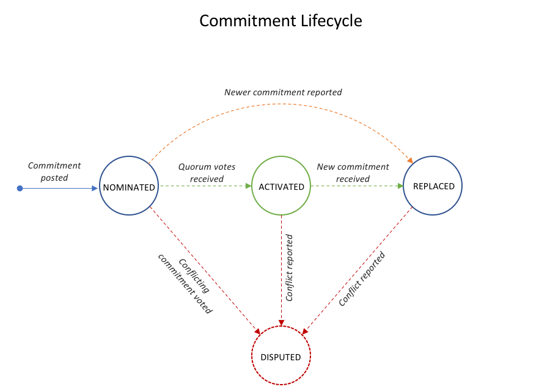

# Ethereum Bulletin Board

The bulletin board is an Ethereum smart contract responsible for managing state commitments coming from a permissioned network. It has two elements:

- **Management Committee**: Which represent the set of parties that are a part of the permissioned network and responsible for maintaining its state. The contract maintains a pair of identities for each committee member consisting of their ethereum account address and their permissioned ledger public key. The former is used for access control during smart contract invocation while the latter is used for validing that votes on state commitments are valid.

- **State Commitments**: Which is a commitment of a snapshot of the state of a permissioned ledger at a specific ledger height. The contract is agnostic of the specific scheme employed to generate the commitment (e.g. RSA Accumulator). The contract enforces a lifecycle for how commitments are managed as shown in the diagram below. Essentially, commitments for a ledger height (which is higher than any ledger height currently submitted or ratified) can be nominated by a party and that commitment will only be ratified and activated when a configurable *quorum* of votes from other committee members is received for that committmment. Members can dispute a commitment at any stage with a conflicting commitment value.



## Setup
### Prerequsites

- [*Truffle*](https://www.trufflesuite.com/): A development and testing framework for Ethereum.

- [*Solc*](https://solidity.readthedocs.io/en/v0.6.4/installing-solidity.html): The solidity compiler.

- [*Ganache (optional)*](https://www.trufflesuite.com/docs/ganache/quickstart): A tool for creating a development Ethereum network.

Install project dependencies with:

```
npm install
```

### Testing

- run `truffle test`: this compiles the relevant contracts, deploys them on a test network provided by Truffle and runs the associated unit tests.

### Network Deployment using Ganache GUI

- Create a workspace in Ganache associated with this truffle project as instructed [here](https://www.trufflesuite.com/docs/ganache/truffle-projects/linking-a-truffle-project)

- Add a new network block in [`truffle-config.js`](./truffle-config.js) containing the network details of your Ganache network, similar to `dev` configuration below:

```javascript
    networks: {
        dev: {
            host: "127.0.0.1",
            port: 7545,
            network_id: "*" // Match any network id
        }
    },
```

### Network Deployment using Ganache CLI

A local Ethereum blockchain can be also deployed using [Truffle's Ganache
CLI](https://github.com/trufflesuite/ganache-cli) tool. Using the
`--deterministic` flag will start the network with the same accounts and keys
every time.

```
npx ganache-cli --deterministic
```

A list of accounts and their private keys will be listed, along with an address
that can be used to connect to the network. By default this is `localhost:8545`.
